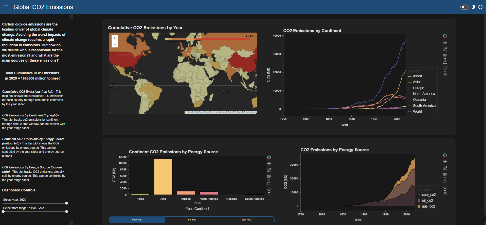

# Global CO2 and Greenhouse Gas Data Dashboard

This data dashboard was created using data collected and processed by *Our World in Data* [(original data)](https://ourworldindata.org/co2-and-other-greenhouse-gas-emissions). This includes 207 country profiles covering a wide range of emissions metrics including total co2 emissions, emissions by energy source and cumulative co2 emissions through time. Additional mapping data comes from the *Natural Earth* low resolution dataset.

I have used this data to create an interactive data dashboard describing co2 profiles by continent and country alongside plots describing co2 emissions by energy source. 
This was created using a dashboarding package in Python called Panel, Hvplot for plot visualisations and Folium for the map plot. Interactivity is a key component of a dashboard so I have included widgets for controlling the plot views and have included tool tips within the plots.

If you would like to learn more about the source data and the team behind this database click [here](https://ourworldindata.org/co2-emissions), the data can also be found directly [here](https://github.com/owid/co2-data) and is distributed with an Creative Commons BY License meaning that you have permission to use, distribute and reproduce the data provided the source and authors are credited.

[The notebook can be found here](https://github.com/callumr97/Data_Dashboard/blob/main/CO2_Data_Dashboard.ipynb)

[The data can be found here](https://github.com/callumr97/Data_Dashboard/blob/main/owid_co2_data.csv)

[The original *Our World in Data* data can be found here](https://github.com/owid/co2-data)

## About the Data Authors

This data was collected, aggregated, and documented by Hannah Ritchie, Max Roser, Edouard Mathieu, Bobbie Macdonald and Pablo Rosado.

The mission of *Our World in Data* is to make data and research on the world’s largest problems understandable and accessible. [Read more about their mission](https://ourworldindata.org/about).
